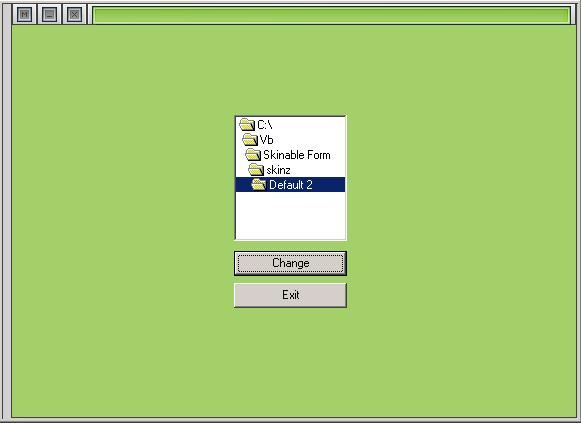



## Skinable Form\!\!\!

### Description

This allows you to change the look of your form easily without haveing to be prescise with the pictures. this loads up the individual pictures and puts them together to display and awsome cover for your form. {See ScreenShot} Please Leave Comments and Vote if you like my code.
 
### More Info
 

             |
---                |---
**Submitted On**   |2000-01-11 21:03:48
**By**             |[�e7eN](https://github.com/Planet-Source-Code/PSCIndex/blob/master/ByAuthor/e7en.md)
**Level**          |Beginner
**User Rating**    |4.3 (13 globes from 3 users)
**Compatibility**  |VB 6\.0
**Category**       |[Miscellaneous](https://github.com/Planet-Source-Code/PSCIndex/blob/master/ByCategory/miscellaneous__1-1.md)
**World**          |[Visual Basic](https://github.com/Planet-Source-Code/PSCIndex/blob/master/ByWorld/visual-basic.md)
**Archive File**   |[Skinable\_F47159182002\.zip](https://github.com/Planet-Source-Code/e7en-skinable-form__1-30556/archive/master.zip)

